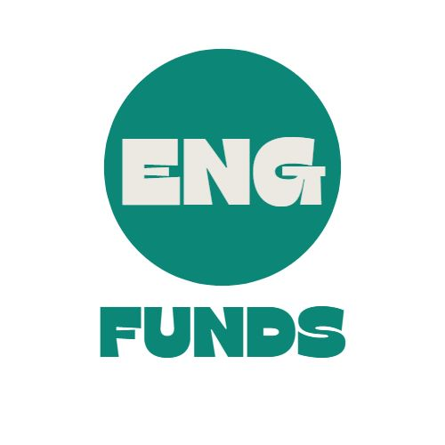

 

  

<h3 align="center">EngFunds - A Fully Decentralized Crowdfunding Platform</h3>
  

# Problem Statement 

Traditionally, banks and venture capital funds are the main way to fill the gap in funding chain. A startup founder would approach a bank or a venture capitalist with his project pitch for funding and if they are interested in the project then the bank or venture capitalist will fund it for some returns, such as equity in case of venture capitalist or loan interest amount in case of banks. However, this way of raising funds has limitations associated with it. This process of fundraising requires huge amount of time, money and valuable resources that project creators from developing countries or remote places do not have access. If we consider bank loan as the solution for funding a project then the bank might become a bottleneck in the project as a bank needs concrete proof of how the project generates revenue and also it requires the founder to provide a collateral for the amount loaned.

# Solution 

Few established crowdfunding platforms such as Kickstarter and Indiegogo have revolutionized the start-up world with the flexibility and efficiency in raising funds. Blockchain based crowdfunding might be the next step in evolution of fundraising platforms assisting start up founders in the journey of building their dream idea. The major issues with these established crowdfunding platforms are that they are centralized bodies controlled by a corporation charging high fees and influencing campaigns. 

# Purpose 

EngFunds allows creators to post their campaigns and then soliciting funds from a community of interested people. Once the funding is successful, it returns the backers with campaign specific NFT. All these multiple transactions are accounted for and kept track of by blockchain, immutable distributed ledger, and thus it is impossible to forge. Blockchain also gets rid of the influence and manipulation done by the centralized crowdfunding platforms that have more than required access to the campaigns running in their platform.

## The EngPay basics
### How do I start a EngPay?
Just tap the green button on our Dapp and connect to your wallet. Then, write your story, set your fundraising goal (which you can lower or raise at any time), and share it out.

### What should I Brief about?
People want to know two things: The purpose of your fundraising and how their contribution will be used. You can add a photo or video to further illustrate your point.

### Are there any fees?
Nand. Everything else goes directly to your cause.
But there is an option available during registration to support our cause. 

### xxx

### Built With

- [Next.js](https://nextjs.org/docs)
- [Tailwind CSS](https://tailwindcss.com/)
- [Solidity](https://soliditylang.org/)
- [Polygon](https://polygon.technology/)
- [The Graph](https://thegraph.com/en/)
- [Sign-in with Ethereum](https://login.xyz/)
